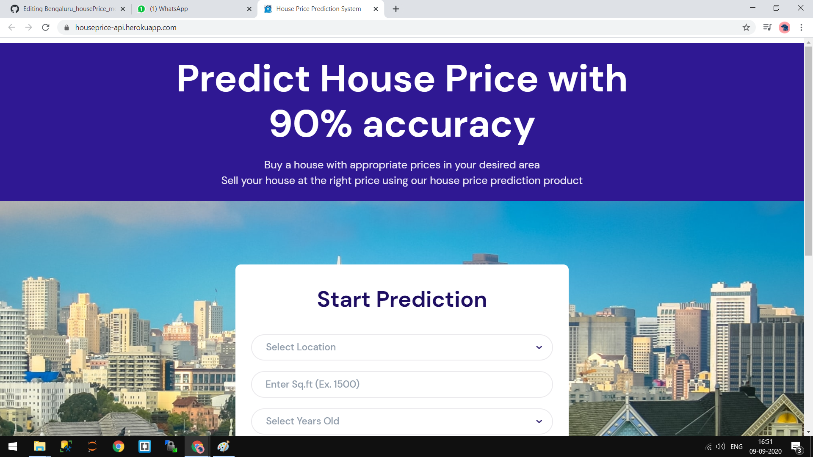
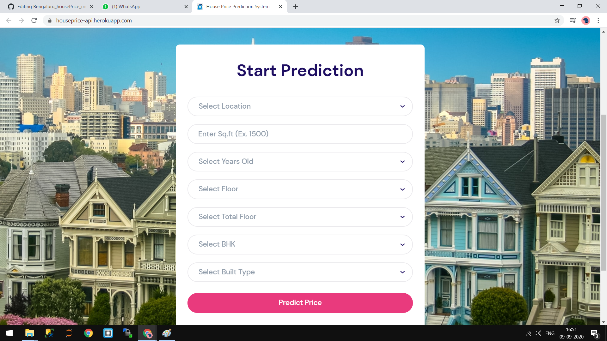
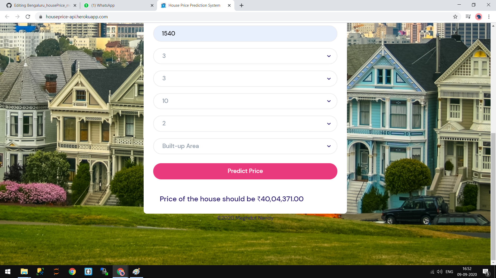

# Bengalore House Price Prediction

> Creating a Bengalore house Price Prediction Machine Learning model on Cloud server(Heroku) & predict house prices based on various features.

## Steps  
>* Train Model
>* Export the model
>* Create a LOCAL REST API by using FLASK web framework.
>* Commit Code into github repository.
>* Link the github repository to heroku Account
>* Deploy the model into heroku
>* Web App is ready

## Architecture of how web application is running on Heroku Server

